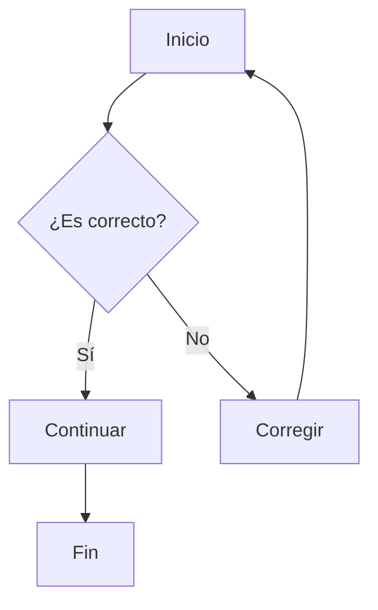
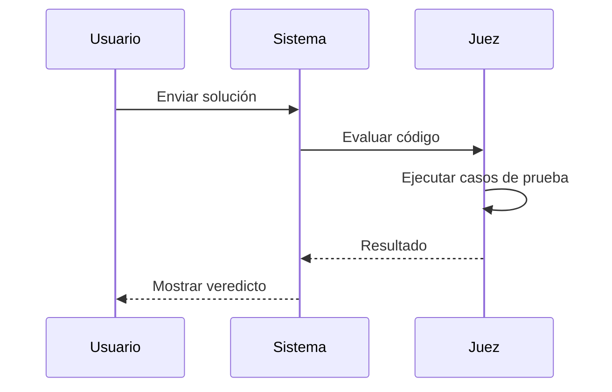
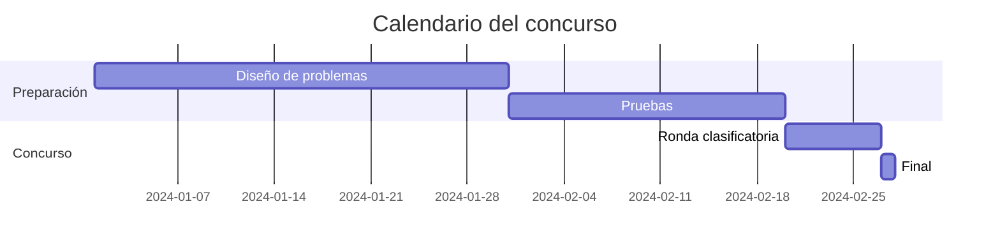
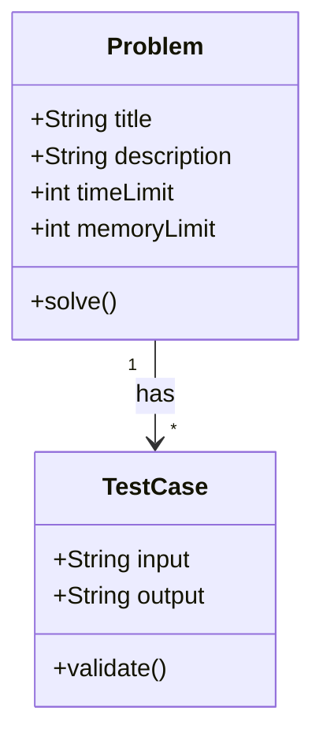
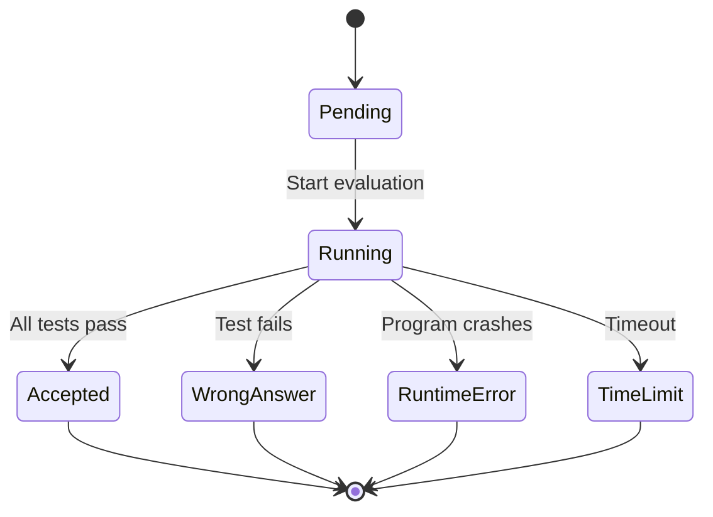

# Prueba de Mermaid en omegaUp

Este es un ejemplo de diagrama de flujo:



## Diagrama de secuencia



## Gráfica de Gantt



## Diagrama de clases



## Gráfica de estados



## Texto normal con LaTeX

Aquí puedes mezclar Mermaid con LaTeX: $f(x) = x^2 + 2x + 1$

Y también con código:

```python
def fibonacci(n):
    if n <= 1:
        return n
    return fibonacci(n-1) + fibonacci(n-2)
```
