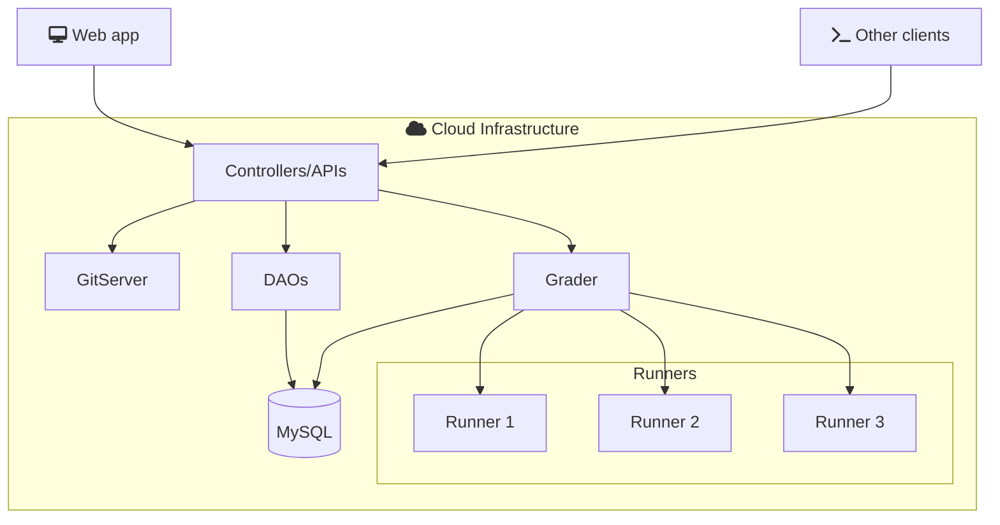

# Software Architecture

omegaUp.com has been designed with the [MVC model](https://en.wikipedia.org/wiki/Model%E2%80%93view%E2%80%93controller).

## MVC Model

The Model-View-Controller (MVC) is a software design pattern that separates an application into three main logical components: the model, the view, and the controller. Each of these components is built to handle specific development aspects of an application.

- **Model**: Represents the data and the business logic of the application. It directly manages the data, logic, and rules of the application.
- **View**: Represents the UI (User Interface) of the application. It displays the data from the model to the user and sends user commands to the controller.
- **Controller**: Acts as an intermediary between the model and the view. It listens to the input from the view, processes it (possibly altering the model), and returns the display output to the view.

## Flowchart

## Technologies

The list of technologies we will use to build the application are as follows:

| Technology          | Purpose                | Version  |
| ------------------- | ---------------------- | -------- |
| MySql            | Database             | [8.0.39] |
| PHP              | Controllers        | [8.1.2]   |
| Python           | Cronjobs             | [3.10.12] |
| Typescript       | Frontend             | [4.4.4]  |
| VueJS            | Frontend             | [2.5.22] |
| Bootstrap4       | Frontend             | [4.5.0] |
| Go               | Grader               | [20.0.1] |

Versions are periodically updated to keep the platform supported by all languages.