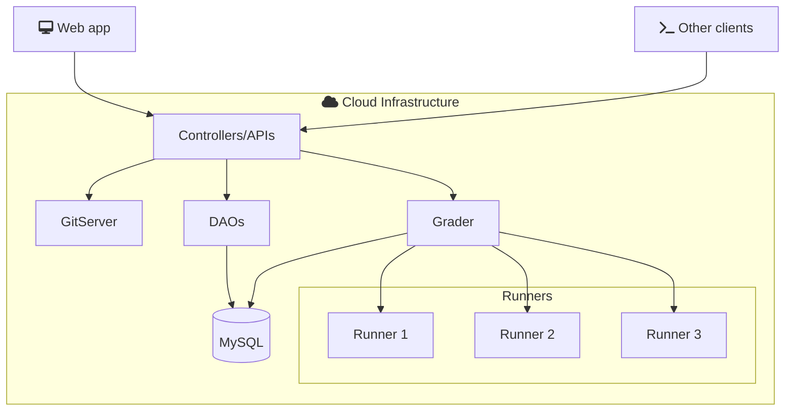

# Arquitectura de software

omegaUp.com se diseñó usando el [modelo MVC](https://en.wikipedia.org/wiki/Model%E2%80%93view%E2%80%93controller).

## Modelo MVC

El Modelo-Vista-Controlador (MVC) es un patrón de diseño de software que separa una aplicación en tres componentes lógicos principales: el modelo, la vista y el controlador. Cada uno de estos componentes está construido para manejar aspectos específicos del desarrollo de una aplicación.

- **Modelo**: Representa los datos y la lógica de negocio de la aplicación. Gestiona directamente los datos, la lógica y las reglas de la aplicación.

- **Vista**: Representa la interfaz de usuario (UI) de la aplicación. Muestra los datos del modelo al usuario y envía los comandos del usuario al controlador.

- **Controlador**: Actúa como intermediario entre el modelo y la vista. Escucha la entrada de la vista, la procesa (posiblemente alterando el modelo) y devuelve la salida de la visualización a la vista.

## Diagrama

## Tecnologías

La lista de tecnologías que usaremos para construir la aplicación son las siguientes:

| Technología          | Propósito                | Versión  |
| ------------------- | ---------------------- | -------- |
| MySql            | Database             | [8.0.39] |
| PHP              | Controladores        | [8.1.2]   |
| Python           | Cronjobs             | [3.10.12] |
| Typescript       | Frontend             | [4.4.4]  |
| VueJS            | Frontend             | [2.5.22] |
| Bootstrap4       | Frontend             | [4.5.0] |
| Go               | Grader               | [20.0.1] |

Las versiones se actualizan periódicamente para mantener la plataforma compatible con todos los lenguajes.