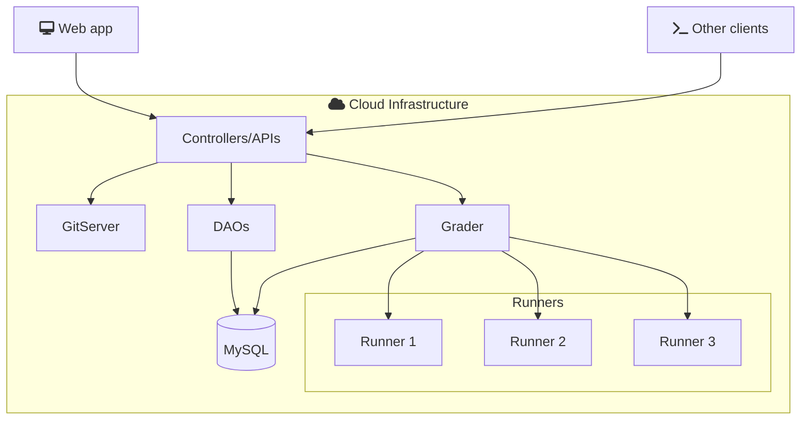

# Arquitectura de software

omegaUp.com se diseño usando el modelo [MVC](https://en.wikipedia.org/wiki/Model%E2%80%93view%E2%80%93controller). 

## Diagrama

## Tecnologías

The list of technologies we will use to build the application are as follows:

| Technology          | Purpose                | Version  |
| ------------------- | ---------------------- | -------- |
| MySql            | Database             | [6.0.9] |
| PHP              | Controladores        | [8.1]   |
| Python           | Cronjobs             | [3.0.1] |
| Typescript       | Frontend             | [2.4.1]  |
| VueJS            | Frontend             | [3.0.2] |
| Bootstrap4       | Frontend             | [4.0.1] |
| Go               | Grader               | [17.0.1] |
